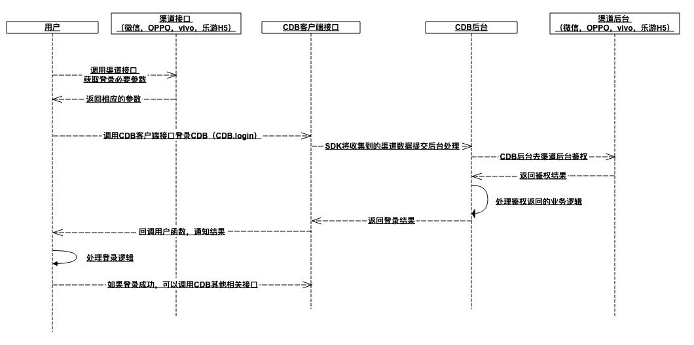
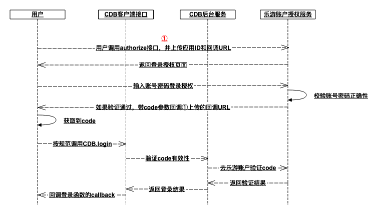

# H5GameVerificationDemo

H5游戏实名认证Demo

## 名词解释

|名称|解释|
|---|---|
|CDB|为单机游戏提供的简单服务器功能。比如登录校验，数据存储等|

## 背景

小游戏可能在2020年之后，会要求版号。而游戏申请版号，需要提供实名认证以及防沉迷机制。因此，针对这个情况，乐游为各CP的单机小游戏，提供了实名认证的接口。

调用实名认证接口有一个前提，必须是一个经过系统鉴权之后的用户。如果CP的小游戏只上微信，OPPO，vivo等渠道，借助乐游CDB的功能，即可轻松实现实名验证。具体可参考[CDB接入文档](https://www.yuque.com/docs/share/697bdf56-f42d-4280-9263-ac495abd86bc?#)

对于H5版本的小游戏，流程略有不同，CP需要按规范从乐游账户系统获取授权code，然后再结合CDB登录接口，实现整个后续功能。

## 流程

## 通过乐游账户授权登录流程

需要结合[CDB接入文档](https://www.yuque.com/docs/share/697bdf56-f42d-4280-9263-ac495abd86bc?#)，此步骤主要是针对如何获取乐游账户授权code。拿到code之后，和其他渠道一样，调用CDB.login登录。

## 步骤

#### 1、需要提供

 - （如果有）游戏对应OPPO，vivo，微信等渠道的相关信息（appid，appkey）
 - H5页面部署的URL
 - 游戏120x120的icon一个

#### 2、调用①接口

浏览器打开https://gw.lightlygame.com/gl-ms-user-auth/oauth/authorize 需要带两个参数

|参数名|参考值|说明|
|---|---|---|
|clientId|2|步骤1之后，乐游提供的gameid|
|callback|http%3A%2F%2F58.87.85.64%2FH5GameVerificationDemo%2Findex.html|登录鉴权成功后，乐游会带着code参数回调的地址，此参数需要urlencode|

## 实例

假如有一个游戏：

（提供）H5页面部署路径：http://58.87.85.64/H5GameVerificationDemo/index.html

（提供）游戏icon：

（获得）乐游为此游戏分配gameid： 2

因此游戏可以通过webview，打开以下授权页面：

https://gw.lightlygame.com/gl-ms-user-auth/oauth/authorize?clientId=2&callback=http%3A%2F%2F58.87.85.64%2FH5GameVerificationDemo%2Findex.html

此接口在用户登录授权之后会带上code，重新访问callback参数提交的地址，如：
http://58.87.85.64/H5GameVerificationDemo/index.html?code=MTU3NzUyMTM1MDY2MzU0NDk

游戏获取此code，继续CDB相应登录操作即可

### cocos creator版本demo
该demo在目录./cocos/下，此demo对应的为cocos creator 2.0.9版本的接入工程。
